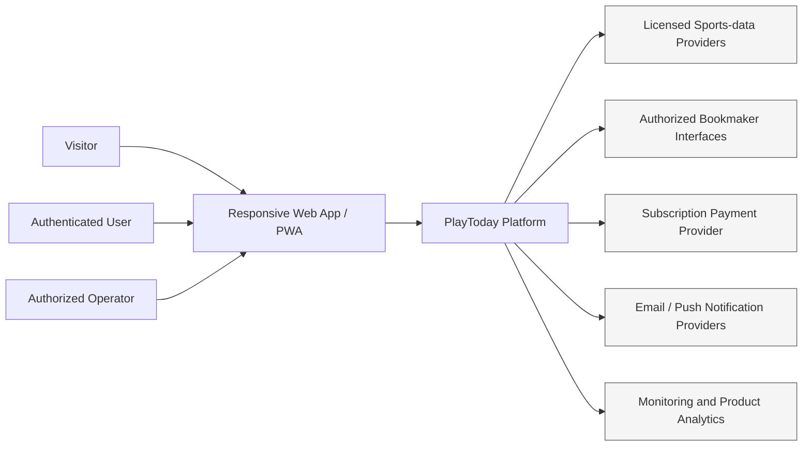
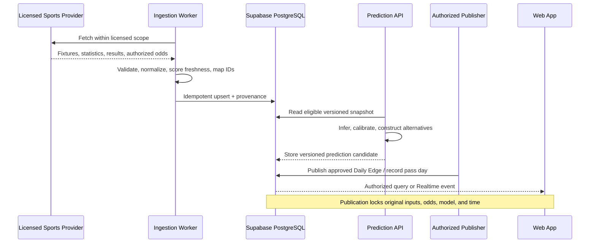
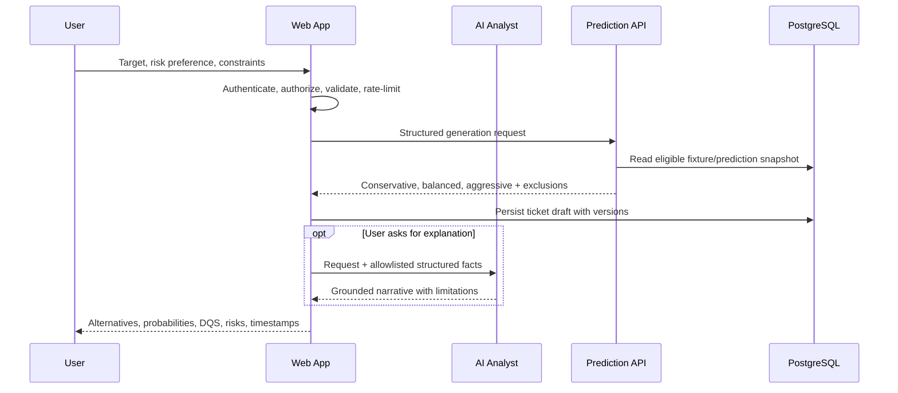
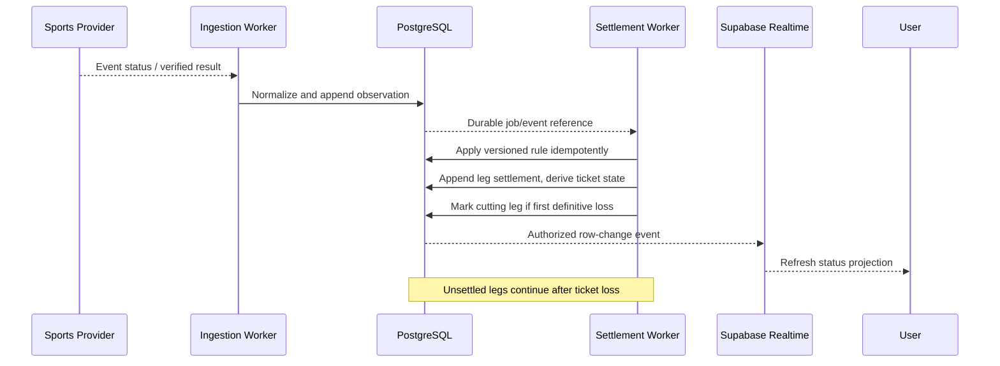
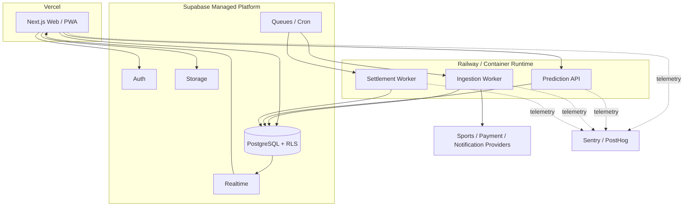

# Architecture

## Status and goals

This document describes the intended architecture. The design prioritizes auditability, deterministic settlement, data provenance, replaceable providers, secure user isolation, and disciplined modularity. PlayToday is the official product name; branding remains configuration-driven rather than a durable domain boundary.

## System context



The platform publishes analysis and tracks prediction artifacts. It does not accept stakes, custody betting funds, log into bookmaker accounts, or place bets.

## Current foundation repository shape

```text
playtoday/
├── apps/web/
├── services/
│   ├── prediction-api/
│   ├── ingestion-worker/
│   └── settlement-worker/
├── packages/
│   ├── ui/
│   ├── database-types/
│   ├── validation/
│   ├── sports-domain/
│   ├── bookmaker-adapters/
│   ├── ai-tools/
│   ├── notifications/
│   └── config/
├── supabase/
├── docs/
└── tests/
```

Step 1B initializes this layout with placeholder boundaries only. The presence of a directory does not mean its future platform, provider, model, or product responsibility has been implemented.

## Major components

### Web application

The planned Next.js 16 and React 19 application owns public pages, authenticated product experiences, PWA behavior, server-rendered views, user-facing APIs where appropriate, and administrative interfaces. It consumes stable domain contracts and never embeds service-role credentials. It must distinguish sourced facts, model estimates, and LLM explanations in the UI.

The web application may coordinate requests but does not train models, ingest provider feeds, or determine settlements. Sensitive operations use server-side authorization and validated commands.

### Supabase operational platform

Supabase PostgreSQL is the system of record for identity-linked product state, normalized sports entities required operationally, odds observations and provenance, prediction artifacts, published tickets/legs, rollover cycles/days, settlement events, disputes, subscriptions/entitlements, notifications, and audit events.

Supabase Auth supplies identity; RLS isolates exposed data; Realtime distributes authorized status changes; Storage holds approved artifacts; Cron and Queues may schedule and dispatch durable work. PostgreSQL—not Realtime—is authoritative. Schema changes use migrations, exposed tables use RLS, and service-role access is restricted to trusted server/worker environments.

### Python prediction service

The FastAPI service owns validated feature assembly, versioned statistical/ML inference, calibration, match eligibility, risk scoring, and target-odds combination construction. Planned libraries include Pydantic, Polars, NumPy, SciPy, scikit-learn, and XGBoost.

Inputs are normalized, timestamped data references and an explicit request policy. Outputs are structured probabilities, fair odds, confidence, DQS, candidate/exclusion reasons, combination alternatives, dependency assessment, and model versions. It does not ingest raw provider feeds, publish tickets directly, settle outcomes, call bookmakers, or generate narrative facts.

### Data ingestion worker

The ingestion worker owns licensed-provider connectivity, rate-limit compliance, retrieval, validation, normalization, deduplication, canonical identity mapping, provenance, freshness calculation, and durable upserts. Provider adapters end here. Bad or conflicting data is quarantined or marked, not guessed.

It does not generate predictions, interpret user prompts, settle markets, or expose provider secrets to the browser.

### Settlement worker

The settlement worker consumes verified normalized event status/results and applies versioned deterministic market rules. It settles every leg, derives ticket status, identifies the ticket-cutting selection, continues processing remaining legs after a loss, and records replay-safe settlement events.

Ambiguity creates a review item. Manual correction is a separate authorized command that appends original/corrected values, reason, actor, evidence, and time. The worker does not use an LLM and does not erase history.

### AI Analyst

The AI Analyst uses the Vercel AI SDK and AI Gateway to interpret user questions and call allowlisted internal tools. Tools return verified structured fixtures, predictions, combinations, history, and analytics. The LLM turns those facts into readable explanations and comparisons.

It cannot write sports facts, probabilities, odds, booking codes, results, or settlements from its own knowledge. Tool schemas, provenance/freshness context, prompt controls, output validation, moderation, rate limits, and trace redaction form the trust boundary. High-impact publication and correction actions are not general chat tools.

### Bookmaker adapters

Adapters in the shared bookmaker package map universal markets into SportyBet, Bet9ja, and MSport representations. They expose capabilities and mapping evidence but do not own predictions or settlements. Official-code operations remain absent or disabled until approved access is documented. See [Bookmaker Integration Policy](BOOKMAKER_INTEGRATION_POLICY.md).

### Payment-provider adapter

The adapter creates and manages subscription billing interactions through an approved provider and translates verified webhook events into internal entitlement commands. It never handles stakes or betting balances. It owns provider-specific identifiers and signature verification; subscription policy remains in the product domain. Provider choice is unresolved.

### Notification system

The notification module builds event-based, preference-aware messages for publication, kickoff/status changes, settlement, rollover milestones, subscription events, and security alerts. A provider adapter handles delivery. Durable records track intent, consent basis, template version, delivery attempts, and status. Quiet hours, opt-outs, cooling-off, self-exclusion, idempotency, and retry limits are enforced before send.

## Clear service boundaries

| Boundary            | Owns                                                                | Must not own                                               |
| ------------------- | ------------------------------------------------------------------- | ---------------------------------------------------------- |
| Web                 | UI, request orchestration, session-aware server endpoints           | Model inference, raw ingestion, deterministic settlement   |
| PostgreSQL/Supabase | Authoritative operational state and access policies                 | Narrative generation, provider polling                     |
| Prediction API      | Model inference, calibration, eligibility, combination construction | Publication mutation, provider secrets, settlement         |
| Ingestion worker    | Provider I/O, normalization, provenance, freshness                  | Prediction and user presentation                           |
| Settlement worker   | Rule-versioned leg/ticket outcomes and correction workflow support  | Generative reasoning, prediction revision                  |
| AI Analyst          | Intent interpretation and grounded explanation                      | Invention of facts or authoritative state changes          |
| Bookmaker adapters  | Universal-to-bookmaker mapping and authorized capability calls      | Account credentials, bet placement, probability generation |
| Payment adapter     | Subscription provider boundary and webhook validation               | Stakes, wallets, product authorization policy              |
| Notification module | Preference/policy evaluation and delivery orchestration             | Source-of-truth settlement or subscription state           |

Cross-boundary communication uses versioned schemas, stable identifiers, correlation IDs, explicit timeouts, idempotency keys for commands, and observable failure states.

## Primary data flows

### Provider ingestion and prediction publication



Publication is a deliberate state transition. The scheduler may prepare candidates but must not silently rewrite a published artifact.

### User target-odds request and AI explanation



The prediction API may return no combination or generated odds below the requested target. The web application must preserve that outcome instead of adding unsupported legs.

### Live state and deterministic settlement



Realtime is a notification mechanism. Clients refetch authorized canonical state and tolerate duplicate, missed, or out-of-order notifications.

## Background jobs

Planned jobs include provider synchronization, freshness evaluation, feature/prediction preparation, Daily Edge qualification, kickoff lock, status refresh, settlement/reconciliation, notification dispatch, model/data monitoring, and retention/export/deletion workflows.

Every job requires:

- a durable job identity and idempotency key;
- explicit input reference and schema version;
- lease/visibility timeout and bounded retries with backoff;
- terminal failure/dead-letter visibility;
- metrics, structured logs, correlation identifiers, and alert thresholds; and
- replay behavior that cannot duplicate publication, settlement, entitlement, or notification effects.

Cron schedules work; queues distribute it. Neither replaces authoritative database constraints or state machines.

## Realtime updates

Authorized Supabase Realtime subscriptions may update fixture, leg, ticket, rollover, and notification views. RLS-compatible access must be verified. The client treats events as hints, applies monotonic/version checks, and refetches after reconnect. Sensitive operational/audit tables are not broadcast directly.

## External provider strategy

Sports-data providers sit behind ingestion adapters and a canonical sports domain. Selection requires coverage, latency, historical depth, live/final status quality, licensing rights, support, rate limits, reliability, and cost review. The provider of official settlement data must be declared, with fallback and conflict rules. No provider has been selected as of Step 1B.

Payment and notification providers also use narrow adapters. External outages must degrade visibly: stale data blocks qualification as configured; payment ambiguity does not grant access; notification failure does not change source state.

## Deployment direction



The intended split is Vercel for the web tier, Supabase for managed operational services, and Railway or an equivalent container runtime for Python services/workers. Environments must be isolated, secrets scoped per service/environment, databases migrated through CI/CD gates, and observability configured with data redaction. Actual vendor projects, regions, networking, scaling, backup, recovery objectives, and spend controls remain future decisions.

## Preventing unnecessary microservices

A folder, package, queue consumer, or process is not automatically a microservice. Begin with the three workload boundaries justified by runtime needs: web, prediction API, and workers (ingestion and settlement may initially share deployment infrastructure while retaining code/domain separation).

A new independently deployed service requires all of the following:

- a boundary that cannot be kept as an in-process module or worker handler;
- independent scale, runtime, security, failure isolation, or release needs;
- a named data owner and versioned interface;
- operational ownership, health checks, alerts, deployment, rollback, and runbook;
- acceptable added latency, consistency, and cost; and
- an accepted ADR.

Do not create separate services per sport, bookmaker, market, dashboard page, or model. Use adapters and domain modules until evidence proves a deployment boundary is necessary. Avoid distributed transactions; keep authoritative state changes within PostgreSQL transactions and use an outbox/event pattern when asynchronous side effects become necessary.

## Architecture invariants

1. Published tickets and their original selections, odds, model versions, and generation times are immutable.
2. Settlement is deterministic, versioned, idempotent, and independently auditable.
3. No LLM output is an authoritative sports fact or settlement.
4. No frontend receives service-role or provider secrets.
5. Every exposed Supabase table has tested RLS.
6. Official bookmaker functions are capability-gated by documented approval.
7. Payment concerns subscriptions only; no betting funds enter the system.
8. User-facing live state can be eventually updated, but canonical state remains queryable and recoverable.
