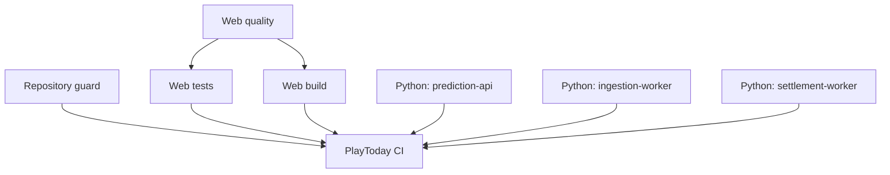

# GitHub and Continuous Integration

## Purpose and repository requirements

Step 1E establishes collaboration and CI controls for the PlayToday foundation. The repository requires one Git root, Node.js 22.16.0 from `.nvmrc`, pnpm 10.28.2 from `package.json`, `pnpm-lock.yaml`, and Python 3.12 or newer. npm, Yarn, and Bun lockfiles are prohibited. CI installs JavaScript dependencies with `pnpm install --frozen-lockfile` and never caches `node_modules`.

## Triggers, permissions, and concurrency

`.github/workflows/ci.yml` runs for every push, pull request, and manual dispatch. Because no remote exists, branch filters are intentionally omitted instead of inventing a remote default branch. Concurrency cancels superseded non-`main` branch/PR runs while retaining default-branch traceability. Revisit the literal `main` protection after a remote default branch is established.

The workflow grants only `contents: read`. Checkout persistence is disabled. There are no write, OIDC, deployment, release, package, issue, or pull-request permissions; no secrets are configured or consumed; and `pull_request_target` is prohibited.

Safe workflow values are `APP_ENV=test`, `LOG_LEVEL=error`, `NEXT_PUBLIC_APP_NAME=PlayToday`, and `NEXT_PUBLIC_APP_URL=http://localhost:3000`. They are not credentials and must not be logged as an environment dump. CI does not load `.env.local` or contact sports, bookmaker, payment, AI, database, hosting, or other external product services.

## Job architecture



- **Repository guard:** checks required paths, the pnpm lockfile, foreign lockfiles, tracked local environment/generated files, nested Git metadata, retired naming, and the example environment contract. It is targeted policy validation, not a complete secret scanner.
- **Web quality:** validates deterministic test environment values, formatting, ESLint/Ruff lint, and TypeScript. Existing root scripts include Python tooling, so Python 3.12 and pinned Ruff are installed for parity.
- **Web tests:** after web quality, runs Vitest/pytest and coverage through existing root commands with pinned pytest.
- **Web build:** after web quality, runs the production Next.js/workspace build with safe CI values.
- **Python quality:** a three-service matrix runs pinned Ruff format/lint and pytest for each placeholder service.
- **PlayToday CI:** always evaluates dependency results and fails unless every required job succeeded. This is the stable check recommended for future branch protection.

## Cache and dependency-update strategy

`actions/setup-node` caches the pnpm content-addressable store using `pnpm-lock.yaml`; it does not cache `node_modules`. `actions/setup-python` caches compatible pip downloads using the pinned root `pyproject.toml`; virtual environments and secret files are not cached. Turborepo caching remains local to each runner, and no paid remote cache or token exists.

Dependabot checks pnpm, GitHub Actions, and root Python development tools weekly with conservative open-PR limits. Compatible minor/patch updates are grouped. Major updates require manual review. Dependabot cannot auto-merge or bypass normal CI.

## Local CI-equivalent command

From a supported PowerShell, Command Prompt, or POSIX shell:

```sh
corepack enable
pnpm install --frozen-lockfile
pnpm ci:check
```

The cross-platform Node orchestrator runs the repository guard, environment checks, format, lint, typecheck, tests, coverage, and build in sequence and exits immediately on failure. Individual Python matrix parity commands are documented in the workflow and use `python -m ruff ...` and `python -m pytest ...`.

## Pull requests, issues, and security

Use the pull-request template, identify one roadmap step, report exact results, and supply security/data/responsible-play reviews or state why they are not applicable. Issue forms prohibit sensitive information. Data/settlement reports request only safe references and redacted evidence. Follow `SECURITY.md` and the approved private GitHub security channel for vulnerabilities; never disclose them publicly.

Ownership remains documented rather than encoded because no verified GitHub handle exists. Branch protection recommendations are in `docs/GITHUB_BRANCH_PROTECTION.md` and have not been applied.

## Troubleshooting and failure inspection

Open the failed workflow run, select the earliest failed required job, and inspect only that step's redacted logs. Confirm the runner used the declared tool versions and frozen lockfile. Reproduce the exact command locally; start with `pnpm install --frozen-lockfile` and `pnpm ci:check`, then run a narrower service command if needed. Never solve CI by weakening checks, using `continue-on-error`, printing all environment variables, or adding write permissions.

If cache behavior is suspect, rerun without changing lock integrity; caches accelerate downloads but do not replace installation. If Linux-only path casing fails, correct the repository path/import so Windows and Linux agree. If the final check fails, inspect every dependency result because it intentionally reports cancelled or skipped required jobs as failure.

## Step 1E boundaries

Deployment is not part of Step 1E. No GitHub secrets, remote repository, hosted integration, Supabase project, Vercel link, release, publication, or automatic merge was configured. Since no remote exists, the first actual GitHub Actions execution remains pending; local workflow parity and YAML/policy checks are the available evidence.
